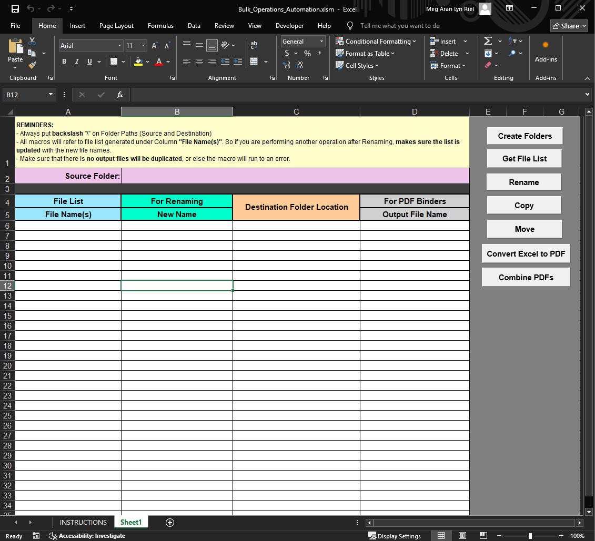

# Bulk Operations Automation (Excel VBA Tool)

An Excel-based automation suite designed to simplify repetitive file management tasks.  
This macro-enabled workbook allows users to create folders, rename files, copy/move documents, convert Excel files to PDF, and combine PDFs — all from a single interface.

## Preview

## Features
- Create multiple folders in one click  
- Generate file lists from a selected directory  
- Bulk rename files inside a specified folder
- Copy or move files between folders  
- Convert Excel files to PDF  
- Combine multiple PDFs into one document  

## Purpose
Designed to reduce manual workload, eliminate repetitive tasks, and improve accuracy in daily operations.

## How to Use
The workbook includes a dedicated Instructions sheet and on‑sheet reminders that guide users through each operation. Simply open the file, review the instructions, and click the buttons to run automations.

## Impact
- Reduced repetitive manual tasks by over 70%  
- Improved consistency in file naming and organization  
- Enabled faster and more reliable file logistics administration
- Helped maintain work‑life balance by significantly reducing after‑hours workload

